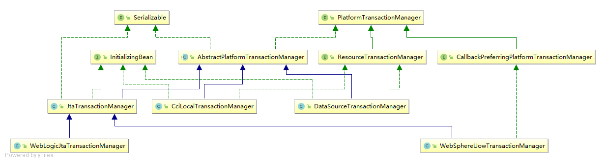

## IOC

IOC(Inversion of Control)，控制反转，DI(Dependency Injection)，依赖注入。

依赖注入方式：

* 构造方法织入
* setter方法注入
* 接口注入，强制被注入的对象实现不必要的接口，带有侵入性。
 
IOC Service Provicer 的职责：
1. 业务对象的构建管理，业务对象无需关系所依赖的对象如何构建如何取得，IOC Service 
Provider需要将对象的构建逻辑从客户端对象那里剥离。
2. 业务对象间的依赖绑定，IOC Service Provider通过结合之前构建和管理的所有业务对象，
以及各个业务对象间可以识别的依赖关系，将这些对象所依赖的对象注入绑定。

IOC管理对象间的依赖关系方式：
1. 直接编码
2. 配置文件
3. 元数据（注解）

## BeanFactory

spring最基础的IOC容器，提供了完整的IOC服务支持。BeanFactory体系结构
见[uml/BeanFactory.uml](./uml/BeanFactory.uml)。

BeanFactory提供了3种方式加载依赖关系。如何使用见
[BeanFactoryTest](.\src\test\java\com\yp\spring\ioc\beanfactory\BeanFactoryTest.java)

BeanFactory层次解析：

* AliasRegistry 别名管理抽象
* BeanDefinitionRegistry IOC的bean definitions注册管理抽象
* SingletonBeanRegistry IOC的单例（shared instances）bean注册管理抽象
* BeanFactory IOC抽象，定义了IOC获取bean
* HierarchicalBeanFactory，ConfigurableBeanFactory 定义了IOC的层次结构
（可以有parent BeanFactory），同时提供了IOC的一些基础配置抽象，比如：类型转换器，
bean ClassLoader，属性编辑器等
* AutowireCapableBeanFactory IOC依赖注入抽象
* ConfigurableListableBeanFactory 
* AbstractBeanFactory
* AbstractAutowireCapableBeanFactory 
* DefaultListableBeanFactory 默认IOC实现

*Bean Factory*可以分层次（通过实现*HierarchicalBeanFactory*接口），
容器A在初始化的时候可以首先加载容器B中的所有对象定义，然后再加载自身的对象定义，
这样容器B就成为了容器A的父容器，容器A可以引用容器B中的所有对象定义：

### Bean

*bean*的*scope*，用来声明容器中对象所应该处的限定场景或者说该对象的存活时间，
即容器在对象进入其相应的scope之前，生成并装配这些对象，在该对象不在处于这些scope之后容器
通常会销毁这些对象。

### BeanFactoryPostProcessor

容器扩展机制，允许我们在容器实例化相应对象之前，对注册到容器的BeanDefinition所保存的信息做相应的修改。

### Bean的一生

实例化Bean对象

设置对象属性

检查Aware相关接口并设置相关依赖

BeanPostProcessor前置处理

检查是否是InitializingBean以决定是否调用afterPropertiesSet方法

检查是否配置有自定义的init-method

BeanPostProcessor后置处理

注册必要的Destruction相关回调接口

使用....

是否实现DisposableBean接口

是否配置有自定义的destory方法

## ApplicationContext

### Resource和ResourceLoader

类结构见[ResourceLoader.urm](uml/ResourceLoader.uml)

Resource，是spring对所有资源的抽象层

ResourceLoader，对资源(Resource)的查找和定位的抽象层

ApplicationContext继承了ResourcePatternResolver，AbstractApplicationContext继承了DefaultResourceLoader，同时内部持有了一个
ResourcePatternResolver的引用，这样ApplicationContext就有了定位资源文件的能力就能够加载配置文件了。

### MessageSource

类结构见[MessageSource.uml](uml/MessageSource.uml)

MessageSource，在java的国际化支持基础上上提供了国际化信息访问的抽象层

### ApplicationContext内部事件发布

ApplicationEvent层次结构见[SimpleApplicationEventMulticaster.uml](uml/SimpleApplicationEventMulticaster.uml)

ApplicationContext内的事件发布机制，主要用于单一容器内的简单消息通知和处理，并不适合分布式，
多进程，多容器之间的时间通知。

1. 使用ApplicationEventPublisherAware接口，注入spring容器的时间发布器
2. ApplicationContext本身也实现了ApplicationEventPublisher，可以直接使用ApplicationContext
达到效果

### ApplicationContext

ApplicationContext层次结构见[ApplicationContext.uml](uml/ApplicationContext.uml)，测试
代码见[ApplicationContextText](src\test\java\com\yp\spring\ioc\application\ApplicationContextTest.java)

### applicationContext装载bean的生命周期过程

<u>初始化阶段</u>

实例化

填充属性

调用BeanNameAware的setBeanName()方法

调用BeanFactoryAware的setBeanFactory()方法

调用ApplicationContextAware的setApplicationContext()方法

调用BeanPostProcessor的预初始化方法

调用InitializingBean的afterPropertiesSet()方法

调用自定义的初始化方法->调用BeanPostProcessor的初始化后方法

<u>初始化完成，可以使用</u>

使用bean

<u>容器关闭阶段</u>

调用DisposableBean的destory()方法

调用自定义的销毁方法

结束

## Spring AOP

### AOP实现

1. 动态代理，JDK1.3引入的*Dynamic Proxy*(动态代理)机制，可以为相应的接口对象动态生成对应的代理对象。
所有需要织入横切关注点逻辑的模块类都得实现相应的接口，因为动态代理是在运行期间使用反射执行的。Spring AOP默认实现。

2. 动态字节码增强，只要符合Java class规范，可以使用ASM或者CGLIB等工具库，在程序运行期间，动态构建字节码
的class文件

3. Java代码生成

4. 自定义类加载器，通过自定义类加载器的方式完成横切逻辑到系统的织入，自定义类加载器通过读取外部文件规定的织入
规则和必要信息，在加载class文件期间就可以将横切逻辑添加到系统模块类的现有逻辑中

5. AOL扩展

### AOP概念

1. Joinpoint：在系统运行之前，AOP的功能模块都需要织入到OOP的功能模块中，所以，要进行这种织入过程，我们
需要知道在系统的哪些执行点上进行织入操作，这些将要在其之上进行织入操作的系统执行点就称之为Joinpoint
2. Pointcut：代表的时Joinpoint的表述方式，将横切逻辑织入到目标系统的过程中，需要参照Pointcut规定的
Joinpoint信息，才可以知道应该往系统的哪些Joinpoint上织入横切逻辑。Pointcut指定了系统中符合条件的一组
Joinpoint。
3. Advice：单一横切关注点逻辑的载体，代表将会织入到Joinpoint的横切逻辑。如果将Aspect比作OOP的class，
那么advice就相当于class中的method。
4. Aspect：就是对系统中横切关注点逻辑进行模块化封装的AOP概念实体。通常情况下，Aspect可以包含多个Pointcut
以及相关advice定义。spring通过@Aspect注解结合普通的POJO来声明Aspect。
5. 织入和织入器：织入（weaving）过程就是架起AOP和OOP的桥梁，在经过织入过程之后，以Aspect模块化的横切关注点
才会集成到OOP的现存系统中，而完成织入过程的那个人就称之为织入器（weaver）。
6. 目标对象（target object）：符合Pointcut所指定的条件，将在织入过程中被织入横切逻辑的对象

一些常见的Joinpoint：
* 方法调用
* 方法执行，强调是某个方法内部执行开始时
* 构造方法调用
* 字段设置
* 字段获取
* 异常处理执行
* 类初始化

Pointcut的表述方式：
* 直接指定Joinpoint所在方法名称
* 正则表达式
* 使用特定的Pointcut表述语言

advice的多个形式：
* before advice，在Joinpoint指定位置之前执行
* after advice，在相应Joinpoint执行位置之后执行
* after returning advice，只有当Joinpoint处执行流程正常完成后，才会执行
* after throwing advice，只有当Joinpoint执行过程中抛出异常的情况下，才会执行
* after advice，不管Joinpoint处的执行流程是正常执行还是抛出异常都会执行
* around advice，对Joinpoint进行包裹，可以在Joinpoint之前和之后都指定相应的逻辑，甚至中断或者忽略
Joinpoint处的原来程序流程的执行，也叫拦截器（interceptor）
* introduction，不是根据横切逻辑在Joinpoint处的执行时机来区分的，而是根据它可以完成的功能而区别于其他
advice类型。

### Spring AOP

spring AOP属于第二代AOP，采用动态代理机制和字节码生成技术实现。动态代理机制和字节码生成都是在运行期间
为目标对象生成一个代理对象，而将横切逻辑织入到这个代理对象中，系统最终使用的是织入了横切逻辑的代理对象，
而不是真正的目标对象。因为动态代理机制只能对实现了interface的类使用，如果某个类没有实现任何interface，
就无法使用动态代理机制为其生成相应的动态代理对象。

Spring AOP仅支持方法级别的Joinpoint，仅支持方法执行类型的Joinpoint。

#### Spring AOP的Pointcut

参看[Pointcut](uml/Pointcut.uml)，[ClassFilter](uml/ClassFilter.uml)，[MethodMatcher](uml/MethodMatcher.uml)

* ClassFilter，用于匹配将被执行织入操作的对象
* MethodMatcher，用于匹配将被织入操作的方法

MethodMatcher：

#### Spring AOP的Advice

参看[Advice](uml/Advice.uml)

pre-class的Advice：
1. Before Advice
2. ThrowsAdvice
3. AfterReturningAdvice，之后方法正常返回的情况下才会执行
4. Around Advice，MethodInterceptor即spring的around advice

pre-instance类型的advice：
1. introduction

#### Spring AOP的Aspect

参看[Advisor](uml/Advisor.uml)

Ordered的作用：系统中单一的横切关注点很少，大多数时候都会有多个横切关注点需要处理，那么系统中就
会有多个advisor存在，通过Advisor实现了*Ordered*接口，我们可以自定义Advisor执行顺序，序号越小
优先级越高，spring AOP默认是按照它们的声明顺序来应用它们的。

#### Spring AOP织入

#### ProxyFactory

参看[ProxyFactory](uml/ProxyFactory.uml) 和ProxyFactory使用demo见*ProxyFactoryTest*。

ProxyFactory继承自ProxyCreatorSupport，而ProxyCreatorSupport里面引用了AopProxyFactory。
而ProxyFactory就是通过AopProxy来创建代理类的。

#### AutoProxy 自动代理机制

参看[AutoProxy](uml/AbstractAutoProxyCreator.uml)

#### TargetSource

#### AopProxyFactory与AopProxy

AopProxyFactory采用抽象工厂模式(Abstract Factory)，通过*AdvisedSupport*来创建一个AopProxy。
默认实现类为DefaultAopProxyFactory。

AopProxy默认两个实现类，JdkDynamicAopProxy和CglibAopProxy。

###Spring AOP 2

#### @AspectJ形式的Spring AOP

@AspectJ的Pointcut声明方式：
1. @Pointcut，是方法级别的注解。execution，Spring AOP仅支持方法执行类型的Joinpoint所以使用它来匹配
拥有指定方法签名的Joinpoint，其中通配符*表示用于任何部分的匹配模式，可以匹配一个word，通配符..用来匹
配包及子包的类型声明，如果用于参数位置则表示匹配0~多个参数。
2. Advice，@Before，@AfterReturning，@After，@Around，@DeclareParents

## spring-jdbc

### JdbcTemplate
参看[JdbcTemplate](uml/JdbcTemplate.uml)

## Spring tx

### 事务

事务就是以可控的方式对数据资源进行访问的一组操作，为了保证事务执行前后，数据资源所承载的系统状态始终处于
正确状态，事务本身有4个限定属性——ACID。

ACID：
* 原子性(Atomicity)，事务所包含的全部操作是一个不可分割的整体，这些操作要么全部提交成功，要么只要其中
一个操作失败，就全部失败
* 一致性(Consistency)，要求事务所包含的操作不能违反数据资源的一致性检查，数据资源在事务执行之前处于
某个数据一致性状态，那么事务执行之后也依然需要保持数据间的一致性状态。这个更像是一种对事务使用者的要求，
但如果事务本身处理出错也会出现不一致的情况。
* 隔离性(Isolation)，主要规定了各个事务之间互相影响的程度，隔离性概念主要面向对数据资源的并发访问，
并兼顾影响事务的一致性。
* 持久性(Durability)，一旦整个事务操作成功提交，对数据所作的变更将被记载并不可逆转

事务的4种隔离级别：
1. Read Uncommitted，最低的隔离级别，一个事务可以读取另一个事务没有提交的更新结果。
2. Read Committed，一个事务的更新操作只有在该事务提交之后，另一个事务才可能读取到同一笔数据更新后的结果
3. Repeatable Read，保证在整个事务的过程中，多同一笔数据的读取结果是相同的，不过其它事务是否同时在对
同一笔数据进行更新，也不管其它事务对同一笔数据的更新提交与否。
4. Serializable，最严格的隔离级别，所有的事务操作都必须依次顺序执行，可以避免所有问题，最为安全的隔离
级别，同时也是性能最差的隔离级别。

并发事务中的读问题：
1. 脏读(Dirty Read)，如果一个事务对数据进行了更新，但事务没有提交，另一个事务就可以“看到”该事务没有提交
的更新结果。这样造成的问题就是，如果第一个事务回滚，那么第二个事务在此之前“看到”的数据就是一笔脏数据。
2. 不可重复读(Non-Repeatable Read)，指同一个事务在整个事务过程中对同一笔数据进行读取，每次读取结果不同
3. 幻读(Phantom Read)，指同样一个查询在整个事务过程中多次执行后，查询所得的结果集是不一样的。

|隔离级别|脏读|不可重复读|幻读|
|----|----|----|----|
|Read Uncommitted|YES|YES|YES|
|Read Committed|NO|YES|YES|
|Repeatable Read|NO|NO|YES|
|Serializable|NO|NO|NO|

|隔离级别| 隔离性 | 并发行 | 一致性 |
| ---- | ---- | ---- | ----|
|Serializable|最高|最低|最高|
|Repeatable Read|高|低|高|
|Read Committed|中|中|中|
|Read Uncommitted|低|高|低|

隔离级别，spring支持设置隔离级别，但是设置的这个隔离级别依赖于具体的数据库实现。事务隔离级别是数据库并发性与
一致性之间的杠杆，提高事务隔离级别，提升了一致性，但降低了数据库的并发性。

* READ_UNCOMMITTED:允许事务读到其他事务未提交的数据，脏读</li>
* READ_COMMITTED:</li>
* REPEATABLE_READ:</li>
* SERIALIZABLE:</li>

XA：
X/Open XA接口应该只被用于你想要在相同事务环境内协调多个资源的情况，XA用到了两段提交。

### Spring的事务

spring事务框架设计的基本原则，让事务管理的关注点与数据访问的关注点相分离

spring的事务抽象见图，[PlatformTransactionManager](uml/Platfor mTransactionManager.uml)。



### 使用spring进行事务管理

编程式事务管理，使用PlatformTransactionManager或者使用TransactionTemplate
声明式事务管理，使用配置文件或注解

# spring profile

spring为环境相关的bean提供的解决方案就是Profile。不是在构建项目时，而是在运行时做出的决策。

> 激活profile依赖两个独立属性：

spring.profiles.active：值被设置，用该值确定哪个profile被激活

spring.profiles.default：如果active没有被设置使用default的值

如果两个都没有被设置，只创建没有profile的bean

> 设置属性的方式：

<ul>
    <li>作为DispatcherServlet的初始化参数</li>
    <li>作为web应用的上下文参数</li>
    <li>作为环境变量</li>
    <li>作为JVM系统属性</li>
    <li>在集成测试类上，使用@ActiveProfile注解设置</li>
</ul>

# 条件化的bean

通过@Conditional，Condition接口来实现

# spring web

> spring mvc流程

->request

1. DispatcherServlet
2. 处理器映射
3. 控制器
4. 模型及逻辑视图名
5. 试图解析器
6. 试图

->response

# spring cache

* @Cacheable:有缓存从缓存查找，没有则执行方法调用再缓存该值
* @CachePut:将方法返回值放入缓存，但该方法会始终执行
* @CacheEvict:清除制定缓存
* @Caching:

# spring集成

> RMI

发布服务:RmiServiceExporter

发现服务:RmiProxyFactoryBean

## SpringBoot配置https 

这里使用JDK自带的keytool生成密钥库，在application.properties中添加如下配置，https成功了

```properties
#生成的密钥库存放位置
server.ssl.key-store=./file/https/httpskey.jks
#生成密钥库时填写的密码，此处我两个密码一致
server.ssl.key-store-password=111111
server.ssl.key-password=111111
```

```shell
keytool -keystore httpskey.jks -genkey -alias tomcat -keyalg RSA
密钥（自己设置)：111111
```

# spring security

> 默认过滤器

* SecurityContextPersistenceFilter：负责从SecurityContextRepository获取或存储SecurityContext，
SecurityContext代表了用户安全和认证过的session
* LogoutFilter：监控一个实际为推出功能的URL，并且在匹配的时候完成用户的推出功能
* UsernamePasswordAuthenticationFilter：监控一个使用用户名和密码基于form认证的url，并在ur
l匹配的情况下尝试认证该用户
* DefaultLoginPageGeneratingFilter：监控一个要进行基于form或OpenID认证的url，并生成展现
登陆form的HTML
* BasicAuthenticationFilter：监控http基础认证头信息并进行出来
* RequestCacheAwareFilter：用于用户登录成功后，重新恢复因为登陆被打断的请求
* SecurityContextHolderAwareRequestFilter：用一个扩展了HttpServletRequestWrapper的子类
包装HttpServletRequest，它为请求处理器提供了额外的上下文信息。
* AnonymousAuthenticationFilter：如果用户到这一步还没有经过认证，将会为这个请求关联一个认证
的token，标识此用户时匿名的。
* SessionManagementFilter：根据认证的安全实体信息跟踪session，保证所有关联一个安全实体的session
都能被跟踪到。
* ExceptionTranslationFilter：解决在处理一个请求时产生的异常信息
* FilterSecurityInterceptor：简化授权和访问控制决定，委托一个AccessDecisionManager完成授权的判断

> Authentication

* Object getPrincipal()：返回安全实体的唯一标识（如，一个用户名）
* Object getCredentials()：返回安全实体的凭证信息
* List<GrantedAuthority> getAuthorities()：得到安全实体的权限集合，根据认证信息的存储决定的。
* Object getDetails()：返回一个跟认证提供者相关的安全实体细节信息

> Vote

* AffirmativeBased：如果有任何一个投票器允许访问，请求将被立刻允许，而不管之前可能有的拒绝决定
* ConsensusBased：多数票（允许或拒绝）决定了AccessDecisionManager的结果，平局的投票和空票（全
是弃权的）的结果时可配置的。
* UnanimousBased：所有的投票器必须是允许的，否则访问将被拒绝。

# 参考
1. 《spring揭秘》
2. spring framework 5